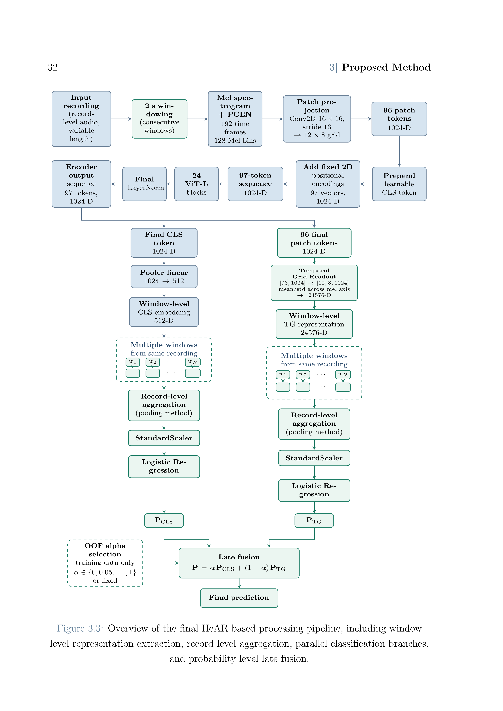

# Respiratory Sound Classification with HeAR

This is the public reproducibility repository for Lorenzo Bianco's MSc thesis, *Respiratory Sound Classification with HeAR: Full Recording Feature Aggregation and Prediction Fusion from Multiple Encoder Readouts*. It evaluates respiratory-sound classification with HeAR and pretrained audio representations.

## Method overview

<p align="center">
  
</p>

<p align="center"><em>Overview of the final processing pipeline. Blue blocks represent the canonical HeAR processing path, while green blocks highlight the extensions introduced in this thesis.</em></p>

Two workflows serve different review needs:

| Workflow | Starts from | Use it for | Coverage |
|---|---|---|---|
| Quick Verification | Packaged pseudonymised predictions, probabilities, protocol manifests and frozen bootstrap draws | Fast CPU-only verification of the thesis statistics and tables | 17/17 tables |
| Full Reproduction | Raw HF Lung and SPRSound/BioCAS audio plus pinned HeAR and OPERA resources | Re-running model inference, downstream fitting and applicable table generation | 14/17 tables |

Quick Verification does **not** reproduce encoder inference from raw audio. Full Reproduction intentionally omits three tables whose event-overlap annotations or frozen bootstrap-draw provenance are available only to Quick Verification.

## Quick Verification

From a clone of this repository:

```bash
git clone https://github.com/lollo-source/respiratory-sound-classification-hear-thesis
cd respiratory-sound-classification-hear-thesis
python3.10 -m venv .venv-quick
source .venv-quick/bin/activate
python -m pip install --upgrade pip
python -m pip install -r requirements-quick-verification.txt
python scripts/quick_verify.py
```

Expected successful summary:

```text
17/17 thesis tables reproduced
17/17 verification PASS
results/quick/RESULTS.md
```

The calculation runs in an isolated temporary copy. A successful run publishes the reviewer-facing bundle at `results/quick/`; a failed run preserves the preceding valid bundle.

## Full Reproduction

Full Reproduction requires Python 3.10, a CUDA-capable GPU, both raw datasets, a HeAR implementation checkout and model snapshot, and an OPERA checkout and three checkpoints. Complete these guides in order:

1. [Environment setup](docs/ENVIRONMENT_SETUP.md)
2. [Dataset acquisition and layout](docs/DATASET_SETUP.md)
3. [HeAR and OPERA setup](docs/MODEL_SETUP.md)
4. [Full execution, stages and resume behavior](docs/FULL_REPRODUCTION.md)

Then, from the repository root, run:

```bash
python scripts/full_reproduce.py \
  --workflow all \
  --stage all \
  --hf-lung-root /path/to/HF_Lung \
  --sprsound-root /path/to/SPRSound \
  --hear-repo /path/to/hear \
  --hear-model-path /path/to/hear-model \
  --opera-root /path/to/OPERA \
  --opera-checkpoint-root /path/to/opera-checkpoints \
  --device cuda:0 \
  --output-dir /path/to/full-output
```

For the strongest clean-room test, use a previously nonexistent output directory outside the Git checkout and omit `--resume`.

Expected successful summary:

```text
Full Reproduction complete
14/17 applicable thesis tables reproduced
14/14 verification PASS
results/full/RESULTS.md
```

The 14/17 count is intentional: the event-capture table and two patient-cluster bootstrap tables are Quick-only. Runtime and intermediate artifacts are written under `--output-dir`; the final reviewer-facing bundle is always published under the repository root at `results/full/`, not inside `--output-dir`.

## Result bundles

Both `results/quick/` and `results/full/` contain:

```text
RESULTS.md
tables/*.csv
machine_readable/*.json
manifest.json
verification.json
```

Calculation code does not use frozen thesis values as scientific inputs. Verification reads them only after fresh results exist. Published BioCAS literature values remain separate under `published_challenge_reference/` and are used only for retrospective comparison after fresh Challenge metrics have been computed.

`PASS` requires every applicable generated table to satisfy the structural, numerical and thesis-display checks documented in [validation status](docs/VALIDATION.md), after the verifier's integrity preflight succeeds.

## Further documentation

- Methods: [experimental protocol](docs/EXPERIMENTAL_PROTOCOL.md), [result lineage](docs/RESULT_LINEAGE.md), and [table map](docs/TABLE_MAP.md)
- Evidence: [validation status](docs/VALIDATION.md) and [privacy sanitisation](docs/PRIVACY_SANITISATION.md)
- Terms: [licences and data access](LICENSES_AND_DATA_ACCESS.md)

Original thesis-authored code is available under the MIT License. Clinical audio, private identifier mappings, HeAR weights and OPERA checkpoints are not redistributed. Third-party datasets and models remain subject to their own terms.
