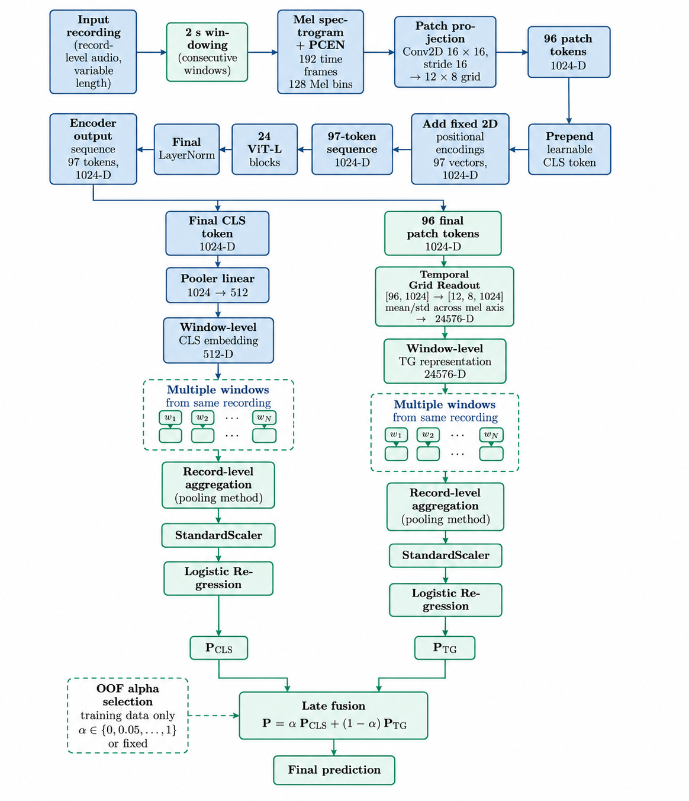

# Respiratory Sound Classification with HeAR

This is the public reproducibility repository for Lorenzo Bianco's MSc thesis, *Extending the Use of HeAR for Respiratory Sound Classification: Full Recording Analysis and Combined Use of Multiple Encoder Representations*. It evaluates respiratory-sound classification with HeAR and pretrained audio representations.

## Method overview

<p align="center">
  
</p>

<p align="center"><em>Overview of the final processing pipeline. Blue blocks represent the canonical HeAR processing path, while green blocks highlight the extensions introduced in this thesis.</em></p>

The repository provides two complementary workflows:

| Workflow | Starts from | Use it for | Coverage |
|---|---|---|---|
| Quick Verification | Packaged pseudonymised predictions, probabilities, protocol manifests and frozen bootstrap draws | Fast CPU-only verification of the thesis statistics and tables | 17/17 tables |
| Full Reproduction | Raw HF Lung and SPRSound/BioCAS audio plus pinned HeAR and OPERA resources | Re-running model inference, downstream fitting and applicable table generation | 14/17 tables |

The 17 mapped tables are the quantitative thesis tables covered by this reproducibility release. They collect the dataset statistics and experimental results reported in the thesis, including Single Window and Complete Record results, Dual Readout performance, per-class analyses, the HeAR–OPERA comparison, official BioCAS Challenge results, event-capture analysis, and bootstrap evaluations. Quick Verification reproduces all 17 from the packaged reproducibility inputs, while Full Reproduction reconstructs 14 through the raw-audio workflows using the pinned model resources and documented public inputs; the remaining three depend on packaged event-annotation or bootstrap provenance. See the [thesis table map](docs/TABLE_MAP.md) for the one-to-one mapping between thesis labels and generated outputs.

The supported public entry points are `scripts/quick_verify.py` and `scripts/full_reproduce.py`. The lower-level `scripts/reproduce_*.py` files are implementation components invoked by Quick Verification, not additional public workflows.

Quick Verification does **not** reproduce encoder inference from raw audio. Full Reproduction intentionally omits three tables whose event-overlap annotations or frozen bootstrap-draw provenance are available only to Quick Verification.

## Quick Verification

From a clone of this repository. The default setup requires Python 3.10 **with
`venv`/`ensurepip` support**; having a `python3.10` executable alone is not
sufficient. If the operating-system `venv` package is unavailable, use the
optional Conda setup in [Environment setup](docs/ENVIRONMENT_SETUP.md).

```bash
git clone https://github.com/lollo-source/respiratory-sound-classification-hear-thesis
cd respiratory-sound-classification-hear-thesis
python3.10 -m venv .venv-quick
source .venv-quick/bin/activate
python -m pip install --upgrade pip
python -m pip install -r requirements-quick-verification.txt
python scripts/quick_verify.py
```

Expected successful summary:

```text
17/17 thesis tables reproduced
17/17 verification PASS
results/quick/RESULTS.md
```

The calculation runs in an isolated temporary copy. A successful run publishes the result bundle at `results/quick/`; a failed run preserves the preceding valid bundle.

## Full Reproduction

Full Reproduction requires Python 3.10 with `venv` support for the default
setup (or the documented optional Conda fallback), a CUDA-capable GPU, both raw
datasets, a HeAR implementation checkout and model snapshot, and an OPERA
checkout and three checkpoints. Complete these guides in order:

1. [Environment setup](docs/ENVIRONMENT_SETUP.md)
2. [Dataset acquisition and layout](docs/DATASET_SETUP.md)
3. [HeAR and OPERA setup](docs/MODEL_SETUP.md)
4. [Full execution, stages and resume behavior](docs/FULL_REPRODUCTION.md)

Then, from the repository root, run:

```bash
python scripts/full_reproduce.py \
  --workflow all \
  --stage all \
  --hf-lung-root /path/to/HF_Lung \
  --sprsound-root /path/to/SPRSound \
  --hear-repo /path/to/hear \
  --hear-model-path /path/to/hear-model \
  --opera-root /path/to/OPERA \
  --opera-checkpoint-root /path/to/opera-checkpoints \
  --device cuda:0 \
  --output-dir /path/to/full-output
```

For a fully fresh reproduction, use a new output directory, preferably outside the Git checkout, and omit `--resume`. This prevents reuse of previously generated feature caches or intermediate artifacts.

Expected successful summary:

```text
Full Reproduction complete
14/17 applicable thesis tables reproduced
14/14 verification PASS
results/full/RESULTS.md
```

The 14/17 count is intentional: the event-capture table and two patient-cluster bootstrap tables are Quick-only. Runtime and intermediate artifacts are written under `--output-dir`; the final result bundle is always published under the repository root at `results/full/`, not inside `--output-dir`.

## Result bundles

Both `results/quick/` and `results/full/` contain:

```text
RESULTS.md
tables/*.csv
machine_readable/*.json
manifest.json
verification.json
```

Calculation code does not use frozen thesis values as scientific inputs. Verification reads them only after fresh results exist. Published BioCAS literature values remain separate under `published_challenge_reference/` and are used only for retrospective comparison after fresh Challenge metrics have been computed.

`PASS` requires every applicable generated table to satisfy the structural, numerical and thesis-display checks documented in [validation status](docs/VALIDATION.md), after the verifier's integrity preflight succeeds.

**Frozen provenance note.** Some machine-readable provenance and verification records intentionally retain historical metadata, internal workflow labels, and development paths from the audited release snapshot. This includes [THESIS_IDENTITY.json](THESIS_IDENTITY.json), [FINAL_CHALLENGE_CONFIGURATION.json](FINAL_CHALLENGE_CONFIGURATION.json), [manifests/ARTIFACTS.json](manifests/ARTIFACTS.json), and material under [reference_results/](reference_results/) and [artifacts/generated/level_c/](artifacts/generated/level_c/). These records are preserved for reproducibility and integrity verification and should not be interpreted as current thesis-title, repository-status, filesystem-path, or public-workflow information. Current thesis information and the supported **Quick Verification** and **Full Reproduction** workflows are documented in this README. See [docs/RESULT_LINEAGE.md](docs/RESULT_LINEAGE.md) for details.

## Further documentation

- Methods: [experimental protocol](docs/EXPERIMENTAL_PROTOCOL.md), [result lineage](docs/RESULT_LINEAGE.md), and [table map](docs/TABLE_MAP.md)
- Evidence: [validation status](docs/VALIDATION.md) and [privacy sanitisation](docs/PRIVACY_SANITISATION.md)
- Terms: [licences and data access](LICENSES_AND_DATA_ACCESS.md)

Original thesis-authored code is available under the MIT License. Clinical audio, private identifier mappings, HeAR weights and OPERA checkpoints are not redistributed. Third-party datasets and models remain subject to their own terms.
